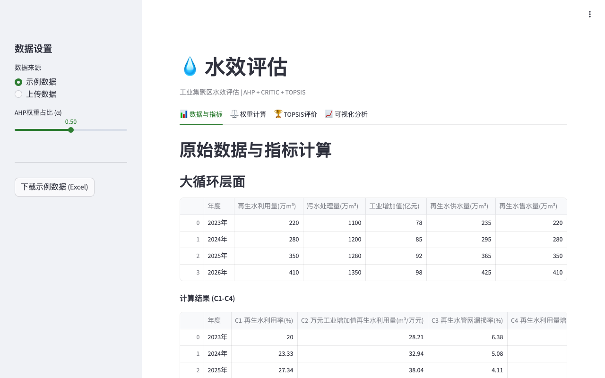

# 💧 Hydro Efficiency — Water Efficiency Assessment

[](https://github.com/zengtianli/hydro-efficiency)
[](LICENSE)
[](https://python.org)
[](https://streamlit.io)

Water efficiency assessment for industrial parks using AHP + CRITIC + TOPSIS methodology across three circulation levels.



## Features

- **AHP + CRITIC combined weighting** — adjustable α parameter for subjective/objective weight blending
- **Three-level evaluation** — macro (park), meso (pipeline), and micro (enterprise) circulation
- **TOPSIS ranking** — enterprise-level scoring and classification
- **Built-in sample data** — pre-loaded example dataset, no file upload required
- **Excel template download** — export blank template for custom data input

## Quick Start

```bash
git clone https://github.com/zengtianli/hydro-efficiency.git
cd hydro-efficiency
pip install -r requirements.txt
streamlit run app.py
```

## Deploy (VPS)

```bash
git clone https://github.com/zengtianli/hydro-efficiency.git
cd hydro-efficiency
pip install -r requirements.txt
nohup streamlit run app.py --server.port 8503 --server.headless true &
```

## Hydro Toolkit Plugin

This project is a plugin for [Hydro Toolkit](https://github.com/zengtianli/hydro-toolkit) and can also run standalone. Install it in the Toolkit by pasting this repo URL in the Plugin Manager.

## License

MIT
